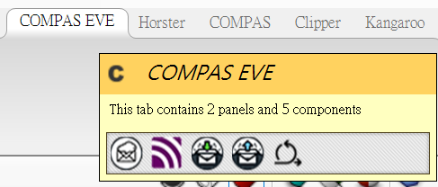
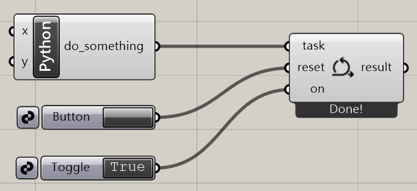

# Compas Eve Example

## Overview

Grasshopper環境內ghpython指令透過CompasEve於外部環境運算，避免Grasshopper因運算過於龐大卡死。

環境配置可按照下列步驟進行，或參考 [environment.yml](example_files/environment.yml)

## Step 1 - Environment Setup

1. Conda創建新環境 *(範例命名: compaseve)*、下載Compas Eve (v1.0.0)
    ```
    conda create -n <project_name> -c conda-forge compas_eve
    ```
2. Activate環境，測試是否下載成功
    ```
    conda activate <project_name>
    python -m compas_eve
    ```
    若顯示
    ```
    COMPAS EVE v1.0.0 is installed!
    ```
    則下載成功

3. 下載CompasEve 到 Rhino 裡 *(印象中好像要加入rhino版本不然會出錯)*
    ```
    python -m compas_rhino.install 
    ```

4. 開啟Grasshopper，使用ghpython輸入以下code，test。測試是否下載成功
    ```
    import compas_eve
    ```
5. 下載好後GH視窗的工作列應該會多一個 COMPASEVE

    

## Step 2 - 使用方式

1. 使用 ` Background task ` Component

2. ` reset ` 前連接 ` Button ` 、 ` on ` 前連接 ` Toggle `

3. 使用ghpython component，輸入以下code
    ```python
    import time
    import random
    import Rhino.Geometry as rg

    def do_something(worker): #<do_something>名稱需與輸出端口一致
        result = []

        for i in range(100):
            x, y = random.randint(0, 100), random.randint(0, 100)
            result.append(rg.Point3d(x, y, 0))
            worker.update_result(result)
            time.sleep(0.01)

        worker.display_message("Done!")

        return result

    ```
4. ghpython component 輸出端命名為 ` do_something ` ，並連接至 ` Background task ` 的 ` task ` 輸入端

## Final Result

整體電池接法如下圖



最終應該可看到在特定方框範圍內，一個一個隨機生成點。

## Example Files

### 範例檔案使用方式

1. 下載[example_files](example_files)資料夾
2. 開啟Grasshopper，開啟範例gh檔 (` Compas-Eve-Example.gh `)

 ` Compas-Eve-Example.gh ` 內含其他應用範例 (Calculating VGA)

## Reference 

[Official Compas-Eve API Documentation](https://compas.dev/compas_eve/latest/installation.html)
