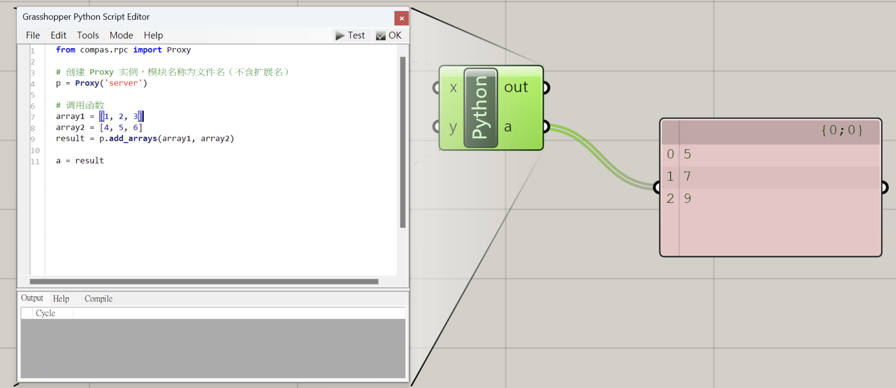

# Compas RPC Example

## Overview

在Grasshopper環境透過CompasRPC調用外部環境Python範例。

可按照下列步驟進行或者直接下載[範例檔案](#Example-Files)。

## Step 1 - Environment Setup

1. Miniconda中創建環境

    ```bash
    conda create -n gh_rpc_env python=3.9
    conda activate gh_rpc_env
    ``` 

2. 下載必要模組

    ```bash
    pip install compas numpy
    ```
    
## Step 2 - Python Setup

1. 創建專案資料夾，範例建立在桌面
    ```
    C:\Users\<USERNAME>\Desktop\CompasRPC
    ```

2. 在專案資料夾中建立python ( 範例為 ` server.py ` )
3. 撰寫Python運算內容 
    ```python
    import numpy as np

    def add_arrays(array1, array2):
    array1 = np.array(array1)
    array2 = np.array(array2)
    return (array1 + array2).tolist()
    ```

## Step 3 - RPCServer Setup

1. 終端中導向專案資料夾
    ```bash
    cd C:\Users\<USERNAME>\Desktop\CompasRPC
    ```

2. 終端輸入 
    ```
    python -m compas.rpc.services.default --port 1753
    ```
    此時終端應顯示
    ```
    Starting default RPC service on port 1753...
    Listening with autoreload of modules enabled...
    Press CTRL+C to abort
    ```

## Step 4 - Grasshopper Setup

1. 開啟Grasshopper，使用GHPython Component
2. 撰寫Code
    ```python
    from compas.rpc import Proxy
    
    p = Proxy('server')  #server對應python模組名稱

    array1 = [1, 2, 3]
    array2 = [4, 5, 6]
    result = p.add_arrays(array1, array2)

    a = result
    ```
3. 點擊test 應顯示
    ```
    Reconnecting to an existing server proxy.
    ```

4. 若以上皆沒問題，將ghpython的 ` a ` 輸出端連接上panel應該可看到` [5, 7, 9] `




## Example Files

使用方式

1. 下載整個[example_files](example_files)資料夾
2. 把 ` CompasRPC ` 資料夾移到桌面
3. 開啟 Anaconda，依序執行以下
    ```
    cd C:\Users\<USERNAME>\Desktop\CompasRPC 
    conda env create -f environment.yml
    conda activate gh_rpc_env
    python -m compas.rpc.services.default --port 1753
    ```
4. 開啟Grasshopper，開啟範例gh檔 (` CompasRPCNumpyTest.gh `)

## Reference 

[Official API Documentation](https://compas.dev/compas/latest/api/compas.rpc.html)

### Further Information

[compas_rpc_example *by yijiangh*](https://github.com/yijiangh/compas_rpc_example)