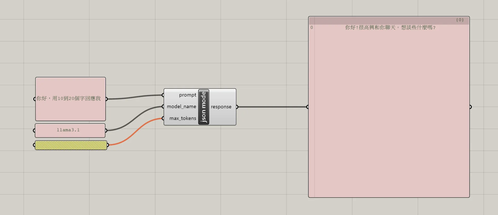

# Ollama in Grasshopper 

How to intergrate llm into grasshopper through ollama, gh python.

將Ollama本地端LLM透過API結合進Grasshopper環境，在Grasshopper中透過ghpython component直接呼叫。

以下操作使用 Windows 11, Rhino 7

### 參考資料 Reference 

以下程式碼改寫自 [chatGPTinGrasshopper *by SerjoschDuering*](https://github.com/SerjoschDuering/chatGPTinGrasshopper) 的內容

## 操作流程  (Generate單一回復)

1. 在Grasshopper Convas中創建一個GHPython Component
2. 開啟編輯器並輸入以下程式碼 
    ``` python
    """GHPython Component
    输入：
        prompt: 要傳給给 Ollama API 的Prompt
        model_name: 要使用的 Ollama 模型（例如，'llama3.2'）
        max_tokens: 響應的最大 tokens 數（默認為 800）
    输出：
        response: API 返回的文字
    """

    import json
    import rhinoscriptsyntax as rs
    import scriptcontext as sc
    import Grasshopper as gh
    import Rhino.Geometry as rg
    import System
    import time

    from System.Net import WebRequest, WebException
    from System.Text import Encoding
    from System.IO import StreamReader

    def call_ollama(prompt, model_name="llama3.2", max_tokens=800, retries=3, retry_delay=5):
        """呼叫 Ollama API 並回傳回應內容。"""

        url = "http://localhost:11434/api/generate" #/api/chat 可聊天

        payload = {
            "model": model_name,
            "prompt": prompt,
            "stream": False,  
            "options": {
                "max_tokens": max_tokens
            }
        }

        json_data = json.dumps(payload)
        bytes_data = Encoding.UTF8.GetBytes(json_data)

        for attempt in range(retries):
            try:
                # 設置 HTTP 請求
                request = WebRequest.Create(url)
                request.Method = "POST"
                request.ContentType = "application/json"

                # 寫入數據到請求流
                with request.GetRequestStream() as stream:
                    stream.Write(bytes_data, 0, bytes_data.Length)

                # 獲取 API 回應
                response = request.GetResponse()
                response_stream = response.GetResponseStream()

                # 讀取回應
                with StreamReader(response_stream) as reader:
                    response_text = reader.ReadToEnd()

                # Print回應文本
                print("Response Text:", response_text)

                # 解析回應
                response_json = json.loads(response_text)
                return response_json['response']

            except WebException as e:
                # 錯誤處理
                if e.Response and hasattr(e.Response, 'StatusCode') and e.Response.StatusCode == 429:
                    print("請求過多。{} 秒後重試...".format(retry_delay))
                    time.sleep(retry_delay)
                else:
                    if e.Response:
                        with StreamReader(e.Response.GetResponseStream()) as reader:
                            error_message = reader.ReadToEnd()
                        print("API 錯誤: {}".format(error_message))
                    else:
                        print("網路錯誤: {}".format(e))
                    return None

        print("所有重試均已失敗。")
        return None

    # 呼叫範例
    response = call_ollama(prompt, model_name, max_tokens)
    a = response  # 將結果傳遞給Component輸出變量

    ```
3. 設置Component輸入、輸出端名稱 ，以及資料格式

如image所示 

4. 在Prompt輸入端Panel中輸入Prompt

## 範例gh檔案

[完整範例檔案](example_files/ollamaingh.gh)

### 說明

若要在gh內以聊天的狀態(有對話紀錄)調用LLM，可將url的地方改成 

`url = "http://localhost:11434/api/chat"`

## 延伸資料

- 設置透過對話歷史文本，使每次調用的內容具有聊天記憶(另存聊天紀錄csv) [參考程式碼](Ollama-in-Grasshopper/ollamainghwithcsvhistory.py)


- 使用OPENAI API, 結合 StableDiffusion API 在 Grasshopper 內的工作流 [參考SerjoschDuering github 內容](https://github.com/SerjoschDuering/chatGPTinGrasshopper)

- [ollama api 中文教學](https://ywctech.net/ml-ai/ollama-first-try/) by *YWC*
- [ollama in python 教學](https://github.com/datawhalechina/handy-ollama/blob/main/docs/C4/1.%20Ollama%20API%20%E4%BD%BF%E7%94%A8%E6%8C%87%E5%8D%97.md) by *Datawhale*
